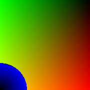

# try-out_glsl_shaders

## sorces

reading:

 - https://learnopengl.com/Getting-started/Shaders

tools:

 - https://github.com/patriciogonzalezvivo/glslViewer

vulkan::

 - https://vkguide.dev/docs/chapter-2/triangle_walkthrough/

||||
|:---:|:---:|:---:|
||||
